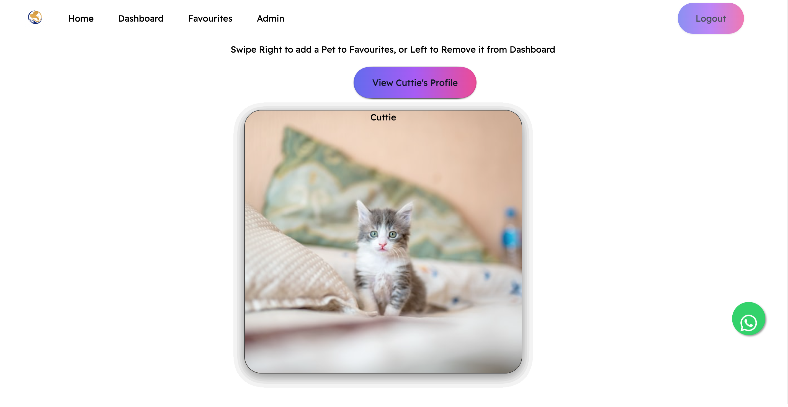
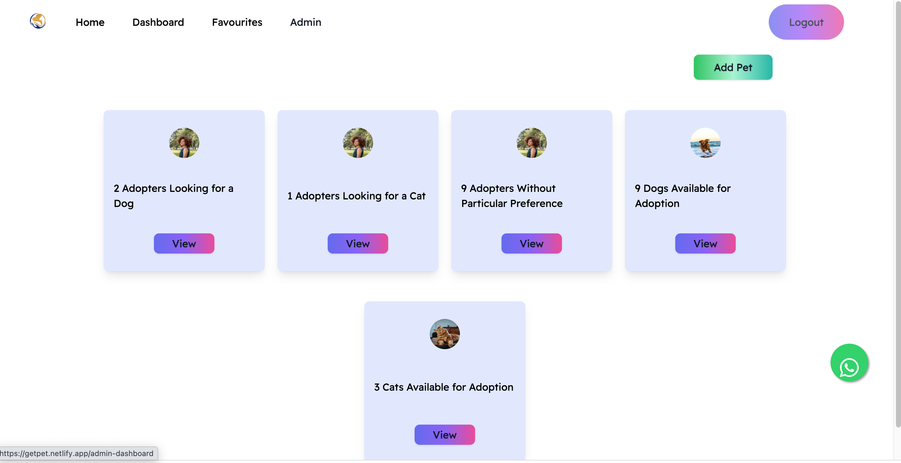

# Pet Adoption Management App

This app can be used by a pet rescue NGO to manage the adoption process. It features a tinder-style dashboard with swipeable cards that make adoption easy and fun.

## Features
Swipeable cards. These cards contain images of the pets that are available for adoption. A potential adopter can swipe right to mark a pet as a favorite or swipe left to remove it from the dashboard.

Admin Dashboard. The admin has visibility of the entire adoption process as well as all the pets available for adoption. He/She can create, edit and delete pet data on the app.

### Main Dashboard

### Admin Dashbaord

## Set Up and Usage
1. Clone this repo to your desktop
2. After cloning this repo, in the root directory, run npm install to install all the dependencies. Once the dependencies are installed, you can run npm run dev to start the API server. You will then be able to access it at localhost:4000
3. Create a MongoDB connection Url and add it to your environment variables.
4. Create an account with Cloudinary and save the API keys to your environment variables.
5. Clone the client (front-end) repo: https://github.com/luckson1/Pet-matching-service
6. After cloning the client repo, navigate to the client folder and run npm install to install all the dependencies. Once the dependencies are installed, you can run npm start to start the client application. You will then be able to access it at localhost:3000
 
## License 
This project is licensed under the terms of the MIT license.
## Contacts
Any inquiries? Email me at: jackgathondu@gmail.com

